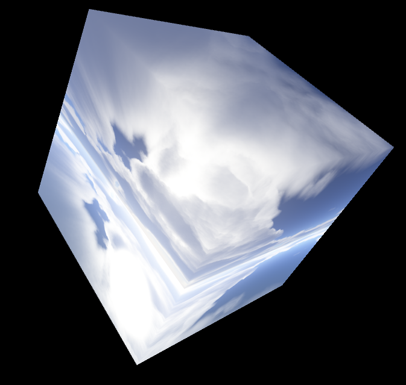
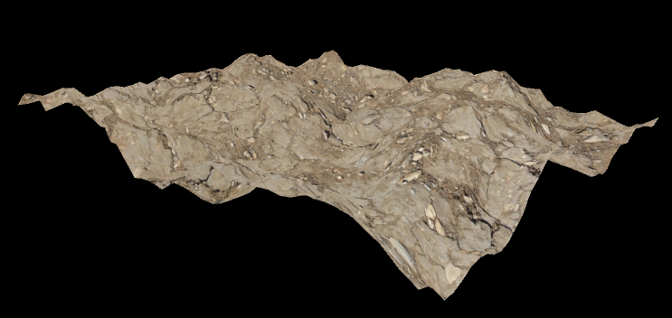
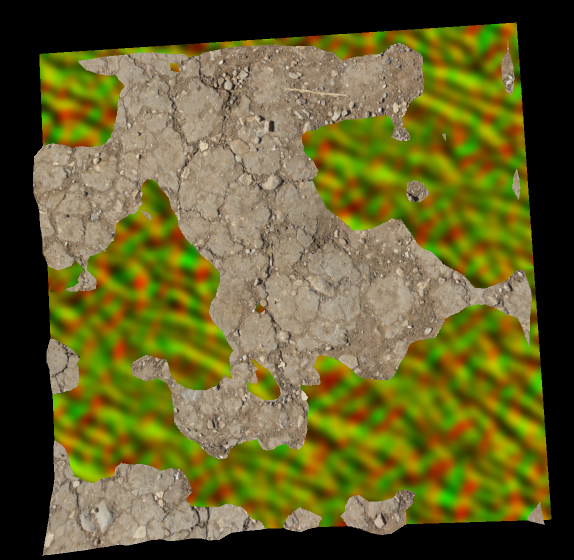

# Informe Water shader
|       Integrante      |                 github nick                   |
|-----------------------|-----------------------------------------------|
| Nicolai Romero         | [anromerom](https://github.com/anromerom) |
| Julian Rodriguez      | [jdrodriguezrui](https://github.com/jdrodriguezrui)       |
| Edder Hernández      | [Heldeg](https://github.com/Heldeg)       |
## Introducción
Este proyecto está dividido en dos partes. Por un lado, buscamos hacer la representación del movimiento de un fluido en un objeto, es decir, ondulaciones. Y por el otro lado, mostrar ciertas propiedades de los líquidos como la refracción y la reflexión.

El trabajo fue inspirado por una propuesta de efecto rápido para videojuegos de la mano del creador de contenido [*Minions Art*](https://www.patreon.com/posts/18245226), en el cual explica cómo en Unity crea el efecto de fluido en botella.

Centrados en el tema, se quiso realizar un proceso de estudio de varios efectos líquidos, concretamente los mencionados anteriormente; el objetivo era obtener un mayor realismo en cuanto a liquido al aplicar una mayor cantidad de detalles. Para este hecho nos basamos en una serie de videos tutorial del canal ThinMatrix llamados [OpenGL water tutorial](https://www.youtube.com/watch?v=HusvGeEDU_U).

Los anteriores recursos pueden tomarse como precedentes a nuestro tema tratado. Aun así, después de una serie de indagaciones respecto a nuestro tema, no fue posible encontrar recurso alguno, semejante, asociado a [processing](https://processing.org/). Es de esta forma que se decidió implementar un ejemplo para este mismo, junto a la ayuda de la librería [nub](https://github.com/VisualComputing/nub#interactivity). 
## Objetivo
Implementar ejemplos del uso de shaders y de gráfos de escena con la librería nub en processing que simule varios aspectos del agua.
## Diseño solución
El proyecto fue dividido en dos partes. Por un lado se trabajaría todo lo referente al efecto de liquido en botella, y por el otro se trataría las propiedades de refracción y reflexión para posteriormente combinar estos dos. En ambos casos se empezó estudiando los ejemplos anteriormente mencionados, para posteriormente ser implementados en Processing.
### Water texture
Para simular el efecto del agua a partir de texturas, se definió un gráfo de escena con la librería *nub*, con elementos que harán parte de la reflexión y refracción del agua, representada con un plano geométrico. Para el terreno, se generó con ruido Perlin, con la función de Processing *noise*,una malla poligonal a la que se le aplicó una textura plana. Para el cielo, se usó el concepto de *Sky boxes* para crear un aspecto general del cielo, con 6 planos lejanos en forma de cubo. Para todos los demás nodos introducidos en escena, se usaron modelos 3D gratuitos en el formato .obj, cargados con la función *loadShape* de processing. Finalmente, se renderiza un plano, con la textura del dudv map, que finalmente representará la distorsión de cada fragmento de agua. Para modificar la textura del agua y simular un aspecto similar al real, se implementan técnicas para mezclar texturas correspondientes a la reflexión y la refracción, distorsionadas en el tiempo con. Haciendo uso de la variable de openGL gl_clipDistance[0], se buscaba crear un plano de *clipping* para que la textura de la reflexión y refracción solo consideraran las geometrías de la escena que estuviesen encima y debajo del plano del agua, respectivamente. Esta idea se implementó, pero debido a problemas con las transformaciones geométricas definidas en processing no fue posible conseguir el efecto deseado de los planos de *clipping*. Aún así, el resultado es apropiado, pero el rendimiento es mejorable, pues en cada frame se renderiza la escena tres veces, con dos perspectivas distintas para la reflexión y la refracción y con una con los elementos ajenos al agua, y con geometrías innecesarias. Después, con el dudv map, un mapa de colores con componentes específicas en los canales de rojo y verde, se introduce una distorsión a las coordenadas de las texturas de reflexión y refracción, para simular la distorsión característica de los cuerpos de agua hallados en la naturaleza. Finalmente, se emplea el efecto de difracción de Fresnel, el cual expresa que la intensidad de la reflexión percebida de un cuerpo como el agua aumenta mientras más perpendicular es la vista al plano del cuerpo observado. Para esto, dependiendo del producto punto de la vista y la normal del plano, se deriva el porcentaje de intensidad que tiene la reflexión respecto de la refracción en el calculo del color final del fragmento. Todas estas ideas y varias más son discutidas por ThinMatrix en su [tutorial de agua con shaders en OpenGL](https://www.youtube.com/watch?v=HusvGeEDU_U).
#### Skybox

#### Terreno con ruido Perlin

#### DuDv map

### Water geometry
Para falsificar el contenido de líquido, se estableció una altura a partir de la que se dejaría de renderizar color en los fragmentos. Haciendo uso de la variable de openGL gl_FrontFacing, se usaría otro color para simular un volumen cuando la superficie del líquido estuviera orientada hacia el ojo de la escena. Ambos colores se establecen como variables al interior de processing y se pasan como parámetros al shader para su uso.

El efecto de ondulación del líquido al mover o rotar el recipiente se logra haciendo uso de las propiedades de posición y orientación del nodo proveído por la librería para processing Nub. Se lleva a cabo el cálculo de la velocidad lineal y angular, y con ellos se cálcula la cantidad de ondulación en los ejes X y Z del líquido para ser utilizados en una onda sinusoidal que es interpolada a 0 con el tiempo para simular la estabilización del líquido. Es el valor de esta onda sinusoidal el que se pasará al shader como parámetro para la ondulación en X y Z.
## Demo
### Water texture
#### Java (by ThinMatrix)

#### Processing

### Water geometry
#### Unity

#### Processing

## Conclusiones
Se logró una porción del objetivo principal. La aplicación de los efectos de reflexión y refracción fue completada por su lado, mientras que se estableció lo básico del efecto de movimiento de liquido en una botella; quedo pendiente la combinación de ambas partes y el pulido de detalles.
